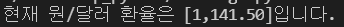

## Crawling

### kospi

- 코스피 지수 크롤링하기

```python
# 라이브러리 가져오기
import requests
from bs4 import BeautifulSoup

url = 'https://finance.naver.com/sise/'
response = requests.get(url).text
data = BeautifulSoup(response, 'html.parser')
exchange = data.select_one('#KOSPI_now')
result = exchange.text

print(f'현재 코스피 지수는 [{result}]입니다.')
```


### Exchange

- 현재 환율 크롤링하기

```python
# 라이브러리 가져오기
import requests
from bs4 import BeautifulSoup

url = 'https://finance.naver.com/marketindex/'
response = requests.get(url).text
data = BeautifulSoup(response, 'html.parser')
exchange = data.select_one('#exchangeList > li.on > a.head.usd > div > span.value')
result = exchange.text

print(f'현재 원/달러 환율은 [{result}]입니다.')
```




### Age

- 이름으로 나이 맞추기 결과 크롤링하기

```python
import requests

name = 'Allen'
url = f'https://api.agify.io/?name={name}'
response = requests.get(url).json()

print(response)
print(response['age'])

```


### Nationalize

- 이름으로 국적 맞추기 결과 크롤링하기

```python
import requests

name = 'Allen'
url = f'https://api.nationalize.io/?name={name}'
response = requests.get(url).json()

for i in range(len(response['country'])):
    print(f"{response['country'][i]['country_id']}")

```

