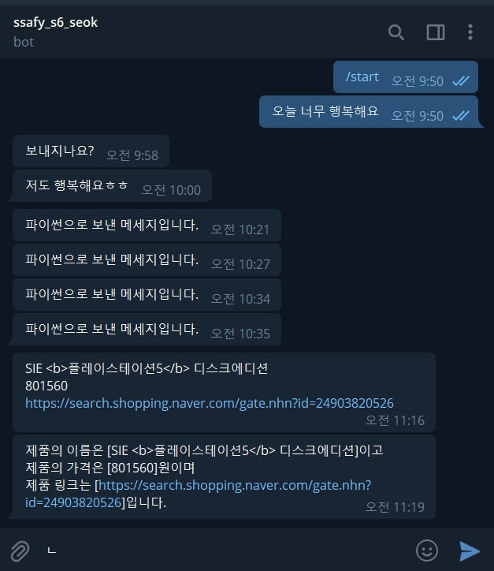
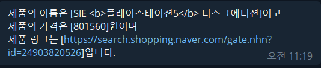

## Chatbot


### naver 쇼핑결과 telegram 전송하기

```python
import requests
from requests.models import Response

#### naver 설정 ####
# naver 요청 보낼 때 필요한 것들
naver_client_id = 'R_yOuHMtfBf6NXuYFw98'
naver_client_secret = 'AGUKGBqKcO'
URL = 'https://openapi.naver.com/v1/search/shop.json?query='

headers = {
    'X-Naver-Client-Id': naver_client_id,
    'X-Naver-Client-Secret': naver_client_secret
}

query = 'ps5'

product = requests.get(URL+query, headers=headers).json()['items'][0]
# print(product)
product_name = product['title']
product_price = product['lprice']
product_link = product['link']

message = f'제품의 이름은 [{product_name}]이고\
    \n제품의 가격은 [{product_price}]원이며\
    \n제품 링크는 [{product_link}]입니다.'

#### telegram 설정 ####
# 기본 설정
TOKEN = '1886611758:AAF5n4FbAvQgU-eaZN3kN3ywA8jaoDco32U'
APP_URL = f'https://api.telegram.org/bot{TOKEN}'

UPDATES_URL = f'{APP_URL}/getUpdates'
response = requests.get(UPDATES_URL).json()

chat_id = response.get('result')[0].get('message').get('chat').get('id')

# text = '파이썬으로 보낸 메세지입니다.'

message_url = f'{APP_URL}/sendMessage?chat_id={chat_id}&text={message}'

requests.get(message_url)

```





